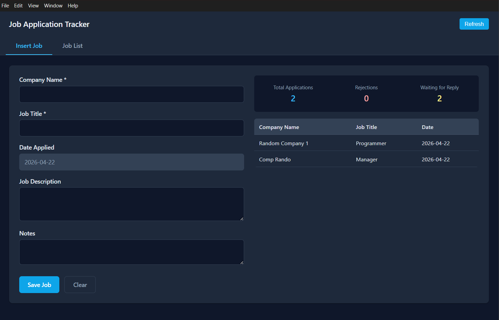
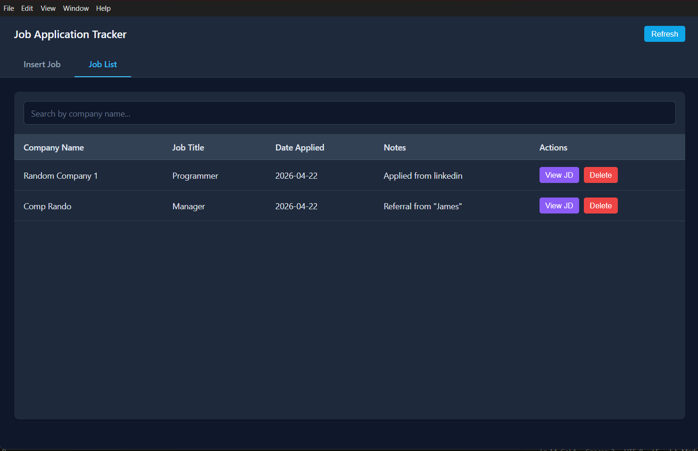

# Job Application Tracker

A desktop application to track and manage your job applications. Built with Electron, it provides an intuitive interface to log, search, and monitor the status of all your job applications in one place.

<!--  -->
<!--  -->


## Features

- **Add Job Applications** - Quickly log new job applications with company name, job title, date applied, job description, and notes
- **Search & Filter** - Search through your job applications by company name
- **Overview Dashboard** - View statistics at a glance including total applications, rejections, and jobs waiting for a reply
- **Inline Editing** - Double-click any cell in the job list to edit directly
- **View Job Descriptions** - Pop up modal to view full job descriptions
- **Data Persistence** - Your job data is saved locally and persists between sessions

## Impact

Job hunting can be overwhelming with numerous applications, follow-ups, and company research. This tool helps you:

- Stay organized by keeping all your application details in one place
- Track application status and follow-up deadlines
- Quickly review job descriptions without searching through emails
- Monitor your job search progress with built-in statistics
- Make informed decisions about which applications to prioritize

## Installation

### Prerequisites

- [Node.js](https://nodejs.org/) (v18 or higher)
- [npm](https://www.npmjs.com/) (included with Node.js)

### Build from Source

```bash
# Clone or navigate to the project directory
cd job-application-tracker

# Install dependencies
npm install

# Run in development mode
npm run dev
```

## Usage

### Adding a Job

1. Open the application
2. The **Insert Job** tab is open by default
3. Fill in the required fields:
   - **Company Name** (required)
   - **Job Title** (required)
   - **Job Description** (optional) - Paste the full job description here
   - **Notes** (optional) - Add any notes, follow-up dates, or use "R" to mark rejections
4. Click **Save Job** to add it to your list

### Marking a Job as Rejected

To mark a job application as rejected:

1. Navigate to the **Job List** tab
2. Find the job application you want to mark
3. **Double-click** the **Notes** cell for that job
4. Type the letter **`R`** into the notes field (in caps)
5. The application will automatically be marked as rejected and reflected in your dashboard statistics

### Managing Jobs

- **Search**: Use the search bar on the Job List tab to filter by company name
- **Edit**: Double-click any editable cell (Company Name, Job Title, Notes) to edit inline
- **View Description**: Click the "View JD" button to see the full job description
- **Delete**: Click the "Delete" button to remove a job application

### Dashboard Overview

The right side of the Insert Job tab shows:
- Total Applications count
- Rejections count (jobs marked with "R" in notes)
- Waiting for Reply count (total minus rejections)
- Recent applications table

## Data Storage

Job applications are stored in a local `jobs.json` file in the application data directory. Your data is stored separately from the application installation, so it persists across updates.

## Technology Stack

- **Electron** - Cross-platform desktop application framework
- **HTML/CSS/JavaScript** - Frontend rendering
- **JSON** - Local data storage

## License

MIT License
